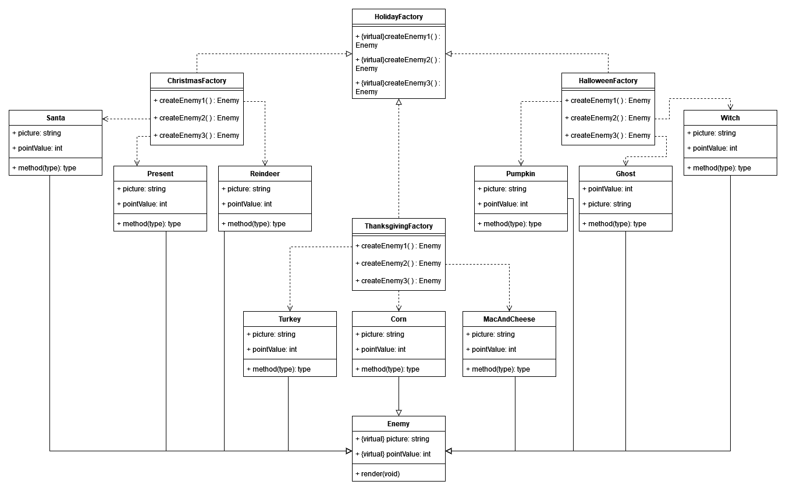

# 8700-game-project

# Game Plan

The idea for the game is a shooter game that will have players shooting at different holiday enemies.

We will have an abstract factory for creating the enemies that are in the game. A first iteration of the UML diagram for the design pattern can be seen below.

There will be a singleton pattern for the GameManager that will control the game operations. Making it a singleton pattern ensures that there is only one of these created.

# Sound Attributions
Shooting_Sounds_003.wav by jalastram -- https://freesound.org/s/362455/ -- License: Attribution 4.0

Hit 1 by NearTheAtmoshphere -- https://freesound.org/s/676461/ -- License: Creative Commons 0

Victory sting 5 by Victor_Natas -- https://freesound.org/s/741977/ -- License: Attribution 4.0

8-bit Game Over Sound/Tune by EVRetro -- https://freesound.org/s/533034/ -- License: Creative Commons 0

turkey gobble 03.wav by klankbeeld -- https://freesound.org/s/608325/ -- License: Attribution 4.0

Sleigh Bells Sound Effect by GowlerMusic -- https://freesound.org/s/265458/ -- License: Attribution 4.0

HalloweenGhost.wav by sound_system11 -- https://freesound.org/s/591511/ -- License: Attribution 4.0

# Code Attributions

Pygame Tutorial with SpaceInvaders
https://github.com/educ8s/Python-Space-Invaders-Game-with-Pygame/blob/main/README.md

Python Crash Course
https://learning.oreilly.com/library/view/python-crash-course/9781098156664/
